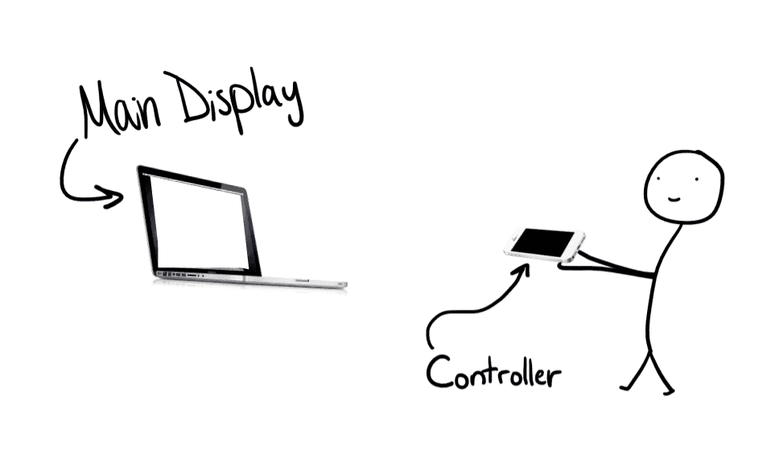

# web-riimote

Turn your smartphone into a 3D controller (think wiimote) with just a web app. No need to install mobile or desktop apps. :warning: **This has only been tested on Chrome.** :warning:

Just visit [web-riimote.herokuapp.com/](https://web-riimote.herokuapp.com/) on a laptop/desktop AND a smartphone. Your smartphone will be the controller and your laptop/desktop will be the main display.


In the screen recording above, the user is pointing and wavering around a smartphone to move the cursor. Tilting the smartphone rotates the steering wheel. The smartphone is connected to the display (shown above) using sockets.

## Getting Started

This section is for people who would like to run this project on their own machine.

You can run this project without being familiar with the technologies used. But if you'd like to make changes, then please be familiar with Vue, Node, Koa, and Socket.io. The client uses Vue. The server uses Node, Koa, and Socket.io.

Please be sure to have Node.js installed before continuing. It is the only prerequisite to run this project.

1.  Clone this repository
2.  `npm install` in both `client/` and `server/`
3.  Create a `server_address.js` file in `client/src/` with the following contents:

```js
// exporting link to server
const PORT = 3000;
const IP_ADDRESS = "123.456.7.890"; // replace this with your laptop's public ip address so you can test it out on your own network
export default `${IP_ADDRESS}:${PORT}`;
```

The `server_address.js` file is imported in `client/src/main.js` and is used when adding the `$socket` instance property to Vue.

4.  `npm run serve` in both `client/` and `server/`. Visit the client on a laptop or device with a large screen (this will be the main display) AND a smartphone (this will be the controller).

### How to set it up

Here's a poorly, partially sketched illustration of what your set up should look like:



The user visits the web app on two devices. One device will be the main display (this device should be a laptop or desktop computer) and the other device will be the 3D controller (this device should be a smartphone). The controller is used to control and interact with objects on the main display.

For the best experience, the controller should be 2 to 3 feet away from the main display's screen (stand further away if the main display is larger than a typical laptop's screen), point the controller's top edge (the top of the smartphone) at the center of the main display's screen, and refresh the webpage. You should now be able to point the controller at the screen and see a cursor.

## How it works

### The Architecture

The server acts as the middleman. The controller emits a message that gets picked up by the server. The server emits the same message but to all clients. Both the controller and main display are clients. So when the server emits a message, the main display can pick it up. This is how the controller can send messages to the main display. Sockets make this possible. Without sockets, the main display would have to constantly check with the server if there are any messages which means a ton of requests per second.

### The Client

The client is the web app which has two main web pages. One web page is for the main display; we'll refer to this as the `MainDisplayView`. The other web page is for the controller; we'll refer to this as the `ControllerView`. When the user visits the web app on the a large screen, they see the web page for the main display. When the user visits the web app on a small device, like a smartphone, they see the web page for the controller.

The `ControllerView` uses the [DeviceOrientation API](https://developer.mozilla.org/en-US/docs/Web/API/Detecting_device_orientation) to gather data from the controller's sensors. It can gather the following data:

- the rate of acceleration along the x, y, and z axes
- the number of degrees by which the device is tilted on the x, y, and z axes (using Euler angles)

[There's much more data the controller _could_ gather](https://whatwebcando.today/) but this is all it needs. It sends this data to the server. The server broadcasts the data. The `MainDisplayView` picks up the data and processes it to determine where the cursor should be and whether the user is shaking the controller.

## Built With

- [Vue.js](https://vuejs.org/) - front end JavaScript framework
- [Buefy](https://buefy.github.io/) - "Lightweight UI components for Vue.js based on Bulma"
- [Node.js](https://nodejs.org/en/) - back end JavaScript framework/runtime
- [Koa](https://koajs.com/) - "a new web framework designed by the team behind Express, which aims to be a smaller, more expressive, and more robust foundation for web applications and APIs"
- [Socket.io](https://socket.io/) - for "real-time bidirectional event-based communication"

## Acknowledgements

The image of the Wii cursor came from [wiibrew.org and was made by drmr](http://wiibrew.org/wiki/Wii_Homebrew_Cursors) and is available in the public domain.
The image of the Wii wheel came from [mariokartwii.wikia.com](http://mariokartwii.wikia.com/wiki/Wii_Wheel).
This project was inspired by the [2016 Android Experiments Winner](https://experiments.withgoogle.com/3d-controller).

## License

[MIT](LICENSE.txt)
